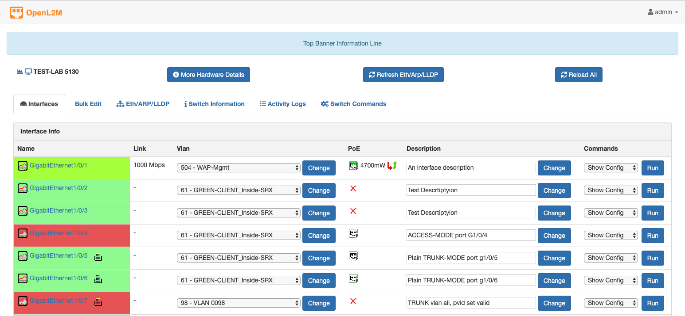

__OpenL2M, Open Layer 2 Management__, is an open source network device management
application designed to allow users with minimal training to perform a set of basic
configuration changes on network switches, with a focus on port or interface (i.e Layer 2) changes.
It does so by providing a consistent web interface
for device management, independent of the underlying switch vendor.  

__Devices Supported:__
* Aruba AOS-CX switches (via REST API)
* HP/Aruba Procurve switches (via SNMP)
* HPE Comware switches (via SNMP)
* Juniper devices (via Junos PyEz API)
* Cisco switches (some, via SNMP)
* Generic SNMP devices
* Any device support by Netmiko library (see SSH devices)
* Most devices supported by Napalm (read-only)
See the documentation for more information.

__Basic Features:__
* enable/disable interface
* change vlan
* enable/disable PoE
* change description
* see ethernet addresses, lldp neighbors
* run configurable pre-defined 'static' commands on the device
* run configurable pre-defined 'form input' commands on the device
* and more...

__What's New:__
v2 implements a new plug-in API that will allow for easy add-on drivers.
This makes is easy to add support for any kind of network device,
whether the interface is SSH, REST, NetConf, or other methods.
See the documentation for more information. We now support Aruba AOS-CX and Juniper device
through custom drivers.

__Why OpenL2M__: OpenL2M was developed in an attempt to learn
Django, and in the hope that it may some day provide a possibly useful
application for distributed "basic" network switch management.
It is developed to address the needs of distributed IT groups managing parts
of a distributed layer 2 ("switching") network.

__License__: OpenL2M is free software: you can redistribute it and/or modify it
under the terms of the GNU General Public License version 3 as published by
the Free Software Foundation.

OpenL2M includes software from third parties, which are either licensed under
the GPL or compatible licenses.
See individual source files for more detailed copyright notices.

This program is distributed in the hope that it will be useful, but WITHOUT
ANY WARRANTY; without even the implied warranty of MERCHANTABILITY or
FITNESS FOR A PARTICULAR PURPOSE. See the GNU General Public License for
more details.  You should have received a copy of the GNU General Public
License along with OpenL2M. If not, see <http://www.gnu.org/licenses/>.

__Documentation__: See the following OpenL2M documentation:

* in the ./docs/ folder (in RST format, buildable with Sphinx, e.g. run 'make html'.
  This will build in ./django/project-static/docs/html/
* after install, from the menu, or at <your-website-url>/static/docs/html/
* at https://openl2m.readthedocs.io/

__Screenshots__:

Interfaces Menu:

BulkEdit Menu:

__Download__:

OpenL2M sources can be found at
<https://github.com/openl2m/openl2m>

Enjoy!
